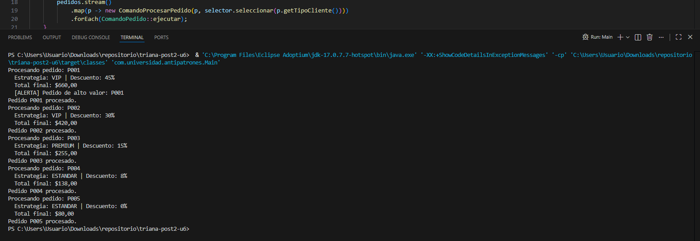

# U6 Post-Contenido 2 - Spaghetti Code a Strategy + Command

## Objetivo
Eliminar Spaghetti Code de procesamiento de pedidos aplicando:
- Patron Strategy para reglas de descuento.
- Patron Command para desacoplar solicitud y ejecucion.

## Estructura clave
- `ProcesadorPedidos`: version inicial con condicionales anidados (conservada).
- `EstrategiaDescuento` + `DescuentoVIP`, `DescuentoPremium`, `DescuentoEstandar`.
- `ComandoPedido` + `ComandoProcesarPedido`.
- `SelectorEstrategia`.
- `Main` con flujo refactorizado.

## Ejecutar
```bash
mvn clean compile
mvn exec:java
```

## Resultado esperado
El flujo final mantiene los casos de negocio, reduce anidamiento y mejora testabilidad al separar decisiones y acciones.

## Evidencias de Verificacion

| Checkpoint | Estado | Evidencia |
|---|---|---|
| Compila sin errores (mvn compile) | PASS | mvn -q -DskipTests compile |
| Existe EstrategiaDescuento y 3 estrategias | PASS | Interfaces y estrategias presentes |
| Existe ComandoPedido y ComandoProcesarPedido | PASS | Patron Command implementado |
| Existe SelectorEstrategia | PASS | SelectorEstrategia.java |
| Main refactorizado procesa pedidos con estrategia y comando | PASS | mvn -q exec:java |
| Repositorio tiene al menos 3 commits | PASS | commits=3 |

### Salida de ejecucion


